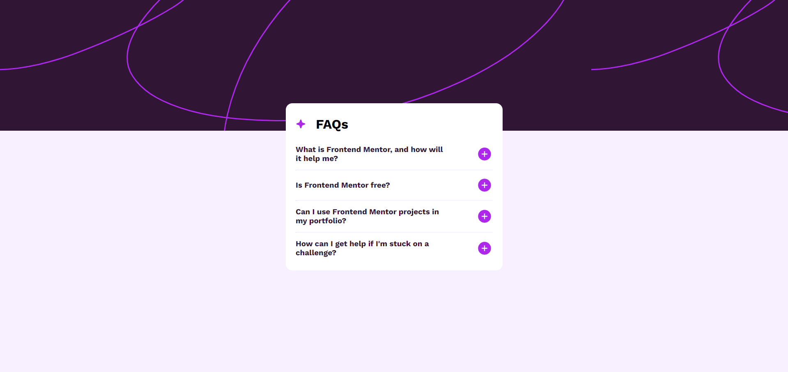
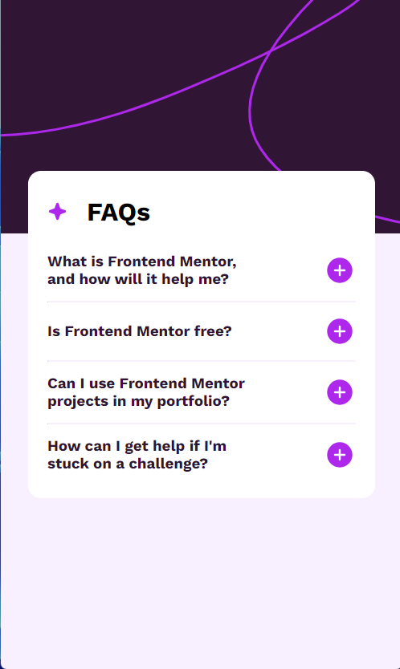

# Frontend Mentor -FAQ accordion solution

This is a solution to the [FAQ accordion challenge on Frontend Mentor](https://www.frontendmentor.io/challenges/faq-accordion-wyfFdeBwBz/hub). Frontend Mentor challenges help you improve your coding skills by building realistic projects.

## Table of contents

- [Overview](#overview)
  - [The challenge](#the-challenge)
  - [Screenshot](#screenshot)
  - [Links](#links)
- [My process](#my-process)
  - [Built with](#built-with)
  - [What I learned](#what-i-learned)
  - [Continued development](#continued-development)
  - [Useful resources](#useful-resources)
- [Author](#author)
- [Acknowledgments](#acknowledgments)

**Note: Delete this note and update the table of contents based on what sections you keep.**

## Overview

### The challenge

Users should be able to:

- Hide/Show the answer to a question when the question is clicked
- Navigate the questions and hide/show answers using keyboard navigation alone
- View the optimal layout for the interface depending on their device's screen size
- See hover and focus states for all interactive elements on the page

### Screenshot

### Links

- Solution URL: [Add solution URL here](https://your-solution-url.com)
- Live Site URL: [Add live site URL here](https://your-live-site-url.com)

## My process

### Built with

- Semantic HTML5 markup
- CSS custom properties
- Flexbox
- CSS Grid
- Mobile-first workflow

### What I learned

I learned about the difference of inline and block elements in this one because i had a problem when adding the background color yellow on the span at first it was an h4 element but upon adding the background color it took up the whole horizontal margin that is where i learned that h4 is a block element and that is when i switch it to span instead. i also learnt a bit more about css such as box-shadow and indentation.

### Useful resources

- [w3schools](https://www.w3schools.com/) - This helped me for learning more about css such as text indentation,box-shadow, etc. and js code such as the accordion and changing the svg icons

## Author

- Frontend Mentor - [@yourusername](https://www.frontendmentor.io/profile/Gabriel-Romme-Reyes)
